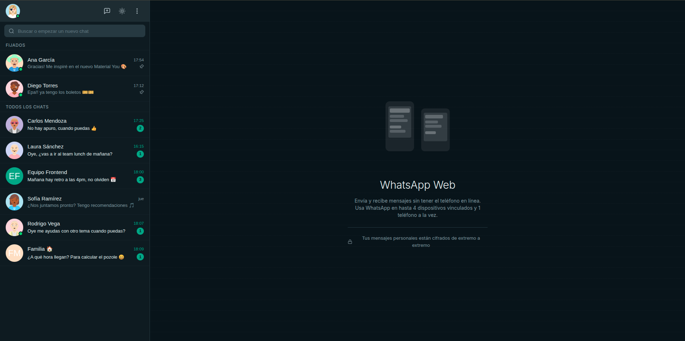

# WhatsApp Web UI Clone

Clon de la interfaz de WhatsApp Web construido con React, TypeScript y Vite. Desarrollado como proyecto de portafolio para demostrar buenas prácticas de desarrollo frontend moderno.




## Funcionalidades

- **Diseño de dos paneles** — Barra lateral con lista de conversaciones y área principal de chat
- **Tema claro / oscuro** — Toggle con persistencia en localStorage y detección de preferencia del sistema
- **Simulación de mensajería** — Envío de mensajes con retroalimentación visual completa
- **Búsqueda** — Filtrar conversaciones por nombre de contacto o contenido del mensaje
- **Conversaciones fijadas** — Sección de chats fijados al inicio de la lista
- **Agrupación de mensajes** — Mensajes agrupados por remitente con umbral de 5 minutos
- **Separadores de fecha** — Separadores visuales entre grupos de mensajes
- **Desplazamiento automático** — Scroll automático al mensaje más reciente
- **Estado en línea** — Indicador de conexión y última vez visto
- **Insignias de no leídos** — Contador de mensajes no leídos en cada conversación
- **Indicadores de estado de mensaje** — Iconos de enviado / entregado / leído en mensajes propios
- **Chats grupales** — Soporte para conversaciones grupales
- **Diseño responsivo** — La barra lateral se oculta en móvil y tablet

## Stack tecnológico

| Categoría | Tecnología |
|-----------|-----------|
| Framework | React 18 |
| Lenguaje | TypeScript 5 (strict) |
| Herramienta de build | Vite 5 |
| Gestión de estado | Zustand 4 |
| Enrutamiento | React Router v6 |
| Iconos | Lucide React |
| Estilos | CSS Modules + CSS Custom Properties |

## Cómo empezar

### Requisitos previos

- Node.js 18+
- npm o pnpm

### Instalación

```bash
# Clonar el repositorio
git clone https://github.com/miigangls/whatsapp-web-ui.git
cd whatsapp-web-ui

# Instalar dependencias
npm install

# Iniciar el servidor de desarrollo
npm run dev
```

Abre [http://localhost:5173](http://localhost:5173) en tu navegador.

### Scripts disponibles

| Script | Descripción |
|--------|-------------|
| `npm run dev` | Inicia el servidor de desarrollo con HMR |
| `npm run build` | Verifica tipos y construye para producción |
| `npm run preview` | Previsualiza el build de producción localmente |
| `npm run lint` | Ejecuta ESLint con reglas estrictas |

## Estructura del proyecto

```
src/
├── app/              # Componente raíz App (tema + enrutamiento)
├── components/
│   ├── chat/         # Área de chat (cabecera, mensajes, input, burbujas)
│   ├── common/       # UI reutilizable (Avatar, Badge, IconButton, StatusIcon)
│   ├── layout/       # AppLayout (contenedor de dos paneles)
│   └── sidebar/      # Lista de conversaciones, barra de búsqueda, cabecera
├── data/             # Datos mock de usuarios, chats y mensajes
├── hooks/            # useAutoScroll, useSearch
├── pages/            # HomePage
├── routes/           # Definición de rutas
├── store/            # Stores de Zustand (chat, tema)
├── styles/           # CSS global y variables de tema
├── types/            # Interfaces de TypeScript
└── utils/            # Utilidades de formato de fecha y hora
```

## Notas de arquitectura

- **Estilos**: CSS Modules para estilos con alcance por componente, CSS Custom Properties para el sistema de temas claro/oscuro — sin dependencias de CSS-in-JS.
- **Estado**: Dos stores de Zustand — `chatStore` (chat activo, mensajes, búsqueda) y `themeStore` (tema + sincronización con localStorage).
- **Alias de rutas**: `@/` apunta a `./src/` para importaciones limpias.
- **Localización**: Fechas y horas formateadas en `es-MX`.

## Licencia

MIT
